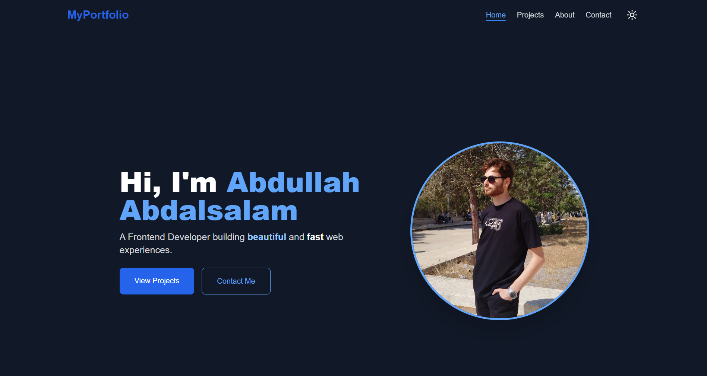

# Abdullah Abdalsalam Portfolio
  

  

## Description
A modern, responsive portfolio website built with **Next.js** and **Tailwind CSS** to showcase my projects, skills, and experience as a Junior Frontend Developer. The website focuses on user experience, performance optimization, and interactive components.

## Technologies Used
- Next.js
- Tailwind CSS
- React.js
- JavaScript
- Vercel (for deployment)

## Features
- Responsive design for all screen sizes
- Interactive project showcase
- Smooth navigation and user experience (UX)
- Optimized performance for faster load times

## Live Demo
[View Portfolio](https://my-portfolio-beryl-nine-29.vercel.app/)

## GitHub Repository
[Portfolio GitHub](https://github.com/Abdullah-Alslam)

## Contact
Email: abdullahxyzabc67@gmail.com  
LinkedIn: [Abdullah Abdalsalam](www.linkedin.com/in/abdullah-abdalslam)
